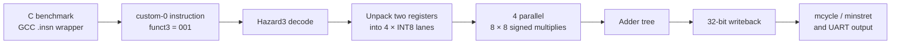

# EdgeMind

*A custom RISC-V ISA extension for accelerating the core dot-product primitive used in quantised neural network inference on FPGA hardware.*

[](https://github.com/ali-002-code/edgemind/actions/workflows/ci.yml)
[](LICENSE)

EdgeMind extends the open-source Hazard3 RISC-V processor with a custom instruction, **`dot4`**, that computes a four-element INT8 dot product in a single instruction. The instruction is integrated directly into the processor pipeline, implemented in Verilog, and evaluated on a Digilent Basys 3 FPGA.

Measured on real hardware, the custom instruction performs the same workload using **3.94× fewer instructions** and **16.9× fewer clock cycles** than the equivalent software implementation while meeting timing at **60.15 MHz**.

## At a glance

- **RTL:** Verilog integration into the open-source Hazard3 RISC-V pipeline
- **Software:** bare-metal RV32IM C with a compiler-independent `.insn` wrapper
- **Verification:** self-checking Icarus Verilog testbench and GitHub Actions
- **Hardware:** Digilent Basys 3, Xilinx Artix-7 XC7A35T
- **Evidence:** on-board cycle/instruction counters and timing-closed synthesis

## Project status

This is a research and portfolio prototype, not a production CPU fork. The
repository pins the exact Hazard3 revision used as a Git submodule and keeps
the EdgeMind modifications in `hardware_patches/` so the changes remain easy
to review.

## Quick start

```bash
git clone --recursive https://github.com/ali-002-code/edgemind.git
cd edgemind
make test
make firmware
make apply-hardware-patches
```

`make test` runs the self-checking `dot4` RTL testbench. `make firmware`
places the ELF, binary, disassembly, map, and block-RAM hex image in `build/`.
Applying the hardware patches modifies only the local, pinned Hazard3
submodule checkout.

---

# Results

The benchmark computes a 256-element INT8 dot product on the same processor using two implementations:

- A standard C implementation using Hazard3's sequential multiplier
- The custom `dot4` instruction

| Metric | Software | `dot4` | Improvement |
|---------|----------|---------|-------------|
| Instructions retired | 1800 | 456 | **3.94× fewer** |
| Clock cycles | 11020 | 652 | **16.9× fewer** |
| Cycles per instruction (CPI) | ~6.1 | ~1.4 | |

Both implementations produce identical numerical results, confirming the correctness of the custom instruction.

Performance was measured directly on the FPGA using the RISC-V **`mcycle`** and **`minstret`** performance counters.

The final implementation closes timing at **60.15 MHz** with:

- Worst Negative Slack (WNS): **+0.398 ns**
- Failing endpoints: **0**

## Why is the cycle improvement larger than the instruction improvement?

Two independent effects combine.

The **3.94× reduction in instructions** is the direct architectural benefit of the ISA extension: each `dot4` instruction performs four INT8 multiply-accumulate operations instead of one.

The larger **16.9× reduction in clock cycles** comes from the implementation of the baseline multiplier. Hazard3's standard software path uses a sequential multi-cycle multiplier that stalls the processor pipeline during every multiplication. In contrast, `dot4` performs four multiplications in parallel inside dedicated hardware and completes the operation without invoking the sequential multiplier.

This difference is reflected in the measured CPI:

- Software: approximately **6.1 CPI**
- `dot4`: approximately **1.4 CPI**

### Real-time performance

Cycle count is only part of the performance story.

The current `dot4` unit is implemented as a single-cycle combinational datapath and forms the processor's critical path, limiting the design to **60.15 MHz**. A pipelined implementation could operate at a significantly higher clock frequency while introducing a small increase in instruction latency. Evaluating that trade-off is discussed in the Future Work section.

---

# Architecture



## The instruction

`dot4` is implemented as a custom R-type instruction using the RISC-V **custom-0** opcode space (`opcode = 0001011`, `funct3 = 001`).

Each source register contains four packed signed INT8 values.

```text
rs1 = {a3, a2, a1, a0}
rs2 = {b3, b2, b1, b0}
```

The instruction computes

```text
rd = a0*b0 + a1*b1 + a2*b2 + a3*b3
```

and writes the accumulated 32-bit result into `rd`.

Conceptually, the instruction is similar to Arm's SDOT instruction.

---

## Hardware implementation

The execution unit (`hazard3_dot4_int8.v`) performs the following operations combinationally:

1. Unpack eight signed INT8 operands.
2. Compute four 8×8 signed multiplications in parallel.
3. Sum the four products using an adder tree.
4. Present the final 32-bit result to the processor's writeback stage.

The combinational logic completes within a single instruction, after which the result is captured by the pipeline register on the following clock edge. No sequential multiplier stalls are introduced.

---

## Integration into Hazard3

Supporting the new instruction required modifications across the processor.

### ISA definitions

Files modified:

- `rv_opcodes.vh`
- `hazard3_ops.vh`
- `hazard3_width_const.vh`

A new internal multiply operation was introduced, expanding the multiply-operation field from three bits to four bits.

### Decode stage

`hazard3_decode.v`

Responsibilities:

- recognise the custom opcode
- generate the new internal operation
- route execution through the processor's multiply datapath

### Execute and writeback

`hazard3_core.v`

Responsibilities:

- instantiate the `dot4` execution unit
- supply register operands
- multiplex the result into the writeback path
- bypass the sequential multiplier stall logic

---

## Software

The benchmark is written in standard C.

The custom instruction is exposed through GCC inline assembly using the `.insn` directive, allowing ordinary C code to invoke `dot4` without modifying the compiler.

Programs are:

1. compiled using the RISC-V GCC toolchain
2. linked to the processor reset vector
3. converted into a binary image
4. converted into a block RAM hex file
5. preloaded into FPGA memory during synthesis

After programming the FPGA, the benchmark executes automatically and prints its results over UART.

---

# Timing verification

An earlier version of the project produced correct benchmark output but failed FPGA timing analysis.

The critical path passed through:

- register-file read
- four parallel multipliers
- adder tree
- writeback register

and exceeded the target clock period by approximately **1.3 ns**.

Although the benchmark appeared to execute correctly, a design that violates timing constraints cannot be considered reliable.

Rather than report those measurements, the design was corrected by reducing the operating frequency until timing closure was achieved.

The final implementation closes timing with:

- Worst Negative Slack: **+0.398 ns**
- Zero failing endpoints

The measured instruction counts and cycle counts remain unchanged because they are independent of clock frequency. The reported results therefore come from a design that is both functionally correct and timing-correct.

---

## Why not enable Hazard3's fast multiplier?

The processor's optional single-cycle 32×32 multiplier was also evaluated.

On the Basys 3 FPGA this configuration failed timing because the implementation spans three DSP blocks together with approximately 900 additional LUTs for partial-product recombination, creating an even longer critical path.

The narrower INT8 datapath therefore provides both:

- higher arithmetic throughput
- a shorter critical path

This illustrates one of the reasons quantised arithmetic is widely used in neural network inference hardware.

---

# Building the project

## Hardware

- Digilent Basys 3
- Xilinx Artix-7 XC7A35T FPGA

## Toolchain

- RISC-V GCC (`riscv64-unknown-elf-gcc`)
- Icarus Verilog (`iverilog` and `vvp`)
- Xilinx Vivado
- Python 3

## Build the benchmark

```bash
make firmware
```

The generated image is `build/dot4_bench.hex`. Copy it to the repository root
as `dot4_bench.hex` before launching the included FPGA top-level from the
repository root. The checked-in image is retained as the reference image used
for the published benchmark.

Programming the FPGA causes the benchmark to execute automatically and print its results over UART at **115200 baud**.

## FPGA configuration

`hardware_patches/fpga_basys3.v`

- System clock: **60.15 MHz**
- `CSR_COUNTER = 1`
- `MUL_FAST = 0`

See [`docs/fpga-reproduction.md`](docs/fpga-reproduction.md) for the exact
automated coverage, board configuration, and the remaining Vivado
reproducibility limitation.

---

# Repository structure

```text
hazard3/
└── ...                       # pinned upstream Git submodule

hardware_patches/
├── hazard3_dot4_int8.v       # new execution unit
├── hazard3_core.v            # modified upstream files
├── hazard3_decode.v
├── hazard3_ops.vh
├── hazard3_width_const.vh
├── rv_opcodes.vh
└── fpga_basys3.v

docs/
└── fpga-reproduction.md

examples/
└── dot4_hardware_test/       # on-board smoke-test program and image

experiments/
├── bringup/                  # early software/UART experiments
└── legacy_testbenches/       # retained, not part of CI

dot4_bench.c
start.S
link.ld
bin2hex.py
Makefile

test_dot4.v                   # self-checking RTL unit test

benchmarks/
├── baseline.md
└── dot4_results.md

README.md
LICENSE
NOTICE
```

The submodule is pinned to Hazard3 commit
`0d59d3065dd39552ad59e3c314a2cf6b800cc9d0`. Run
`git submodule update --init` if the repository was cloned without
`--recursive`.

---

# Future work

## Pipeline the execution unit

The current `dot4` implementation is entirely combinational and forms the processor's critical path.

A natural extension would be to divide the datapath into two pipeline stages by registering the multiplication results before the final accumulation.

This would increase instruction latency by one cycle while potentially allowing a significantly higher clock frequency.

The trade-off should be evaluated by measuring:

- execution time
- maximum clock frequency
- CPI
- FPGA resource usage

to determine whether the higher operating frequency outweighs the additional pipeline stage.

---

## Wider packed operations

`dot4` processes four INT8 values per instruction.

Future extensions could introduce wider packed operations, such as eight-element dot products using register pairs, increasing arithmetic density while exploring the trade-off between hardware complexity and software overhead.

---

# Conclusion

EdgeMind demonstrates how a lightweight ISA extension can substantially accelerate the core dot-product primitive used in quantised neural network inference while preserving a conventional RISC-V software development flow on FPGA hardware.

---

# License

EdgeMind is licensed under the Apache License 2.0. The project includes and
modifies files from [Hazard3](https://github.com/Wren6991/Hazard3), also under
Apache-2.0. See `LICENSE` and `NOTICE` for details.
