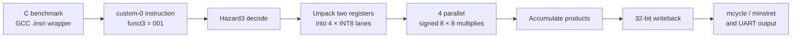

# EdgeMind

*A custom RISC-V INT8 dot-product ISA extension implemented and benchmarked on a Xilinx Artix-7 FPGA.*

[](https://github.com/ali-002-code/edgemind/actions/workflows/ci.yml)
[](LICENSE)

EdgeMind extends the open-source Hazard3 RISC-V processor with **`dot4`**, an
instruction that multiplies four pairs of packed signed INT8 values and sums
the products. The instruction is implemented in Verilog, integrated into the
processor pipeline, and evaluated on a Digilent Basys 3 FPGA.

On a 256-element dot product, the measured hardware benchmark retires **3.94×
fewer instructions** and takes **16.9× fewer clock cycles** than the scalar
software implementation on the same core. The complete FPGA design meets its
60.15 MHz timing constraint.

## At a glance

- **Architecture:** custom RISC-V instruction integrated into Hazard3
- **RTL:** four parallel signed 8×8 multipliers and an accumulation datapath
- **Software:** bare-metal RV32IM C with a compiler-independent `.insn` wrapper
- **Verification:** directed tests plus 10,000 deterministic random vectors
- **Hardware:** Digilent Basys 3, Xilinx Artix-7 XC7A35T
- **Measurement:** on-chip `mcycle`/`minstret` counters and UART output

This is a research and portfolio prototype, not a production CPU fork. The
repository pins the exact Hazard3 revision used and keeps the EdgeMind changes
in `hardware_patches/` so they remain easy to review.

## Architecture



### Instruction semantics

`dot4` uses the RISC-V `custom-0` opcode space (`opcode = 0001011`,
`funct3 = 001`). Each source register contains four packed signed INT8 values:

```text
rs1 = {a3, a2, a1, a0}
rs2 = {b3, b2, b1, b0}

rd = a0*b0 + a1*b1 + a2*b2 + a3*b3
```

The implementation unpacks the lanes, computes four signed products in
parallel, accumulates them into a 32-bit result, and routes that result through
the processor writeback path. Integration touches the opcode definitions,
decode logic, internal operation encoding, execute path, and result mux. The
custom operation bypasses the sequential multiplier's stall condition.

## Performance

The benchmark computes a 256-element signed INT8 dot product with two
implementations on the same processor:

1. scalar C using Hazard3's sequential multiplier (`MUL_FAST = 0`); and
2. packed C/assembly using one `dot4` instruction per four elements.

| Metric | Scalar software | `dot4` | Improvement |
|---|---:|---:|---:|
| Instructions retired | 1,800 | 456 | **3.94× fewer** |
| Clock cycles | 11,020 | 652 | **16.9× fewer** |
| Cycles per instruction | ~6.1 | ~1.4 | — |

Both implementations return `-1` for the published input and the on-board
firmware reports `[MATCH]`. Counts were read on the Basys 3 using the RISC-V
`mcycle` and `minstret` CSRs.

The **3.94× instruction reduction** is the direct ISA benefit of processing
four element pairs per instruction. The larger cycle reduction also reflects
the sequential baseline multiplier, which stalls the pipeline for each scalar
multiplication. It should not be interpreted as a general 16.9× speedup for
arbitrary AI workloads.

See [`benchmarks/dot4_results.md`](benchmarks/dot4_results.md) for the recorded
configuration and benchmark interpretation.

## FPGA implementation results

These post-route results are for the **complete implemented Hazard3/EdgeMind
SoC**, not the incremental hardware cost of the `dot4` instruction.

- **Board:** Digilent Basys 3
- **Device:** Xilinx Artix-7 XC7A35T
- **Implemented clock:** 60.15 MHz
- **Tool used for the captured results:** Vivado 2025.2

### Timing

| Check | Result |
|---|---:|
| Worst setup slack (WNS) | **+0.398 ns** |
| Worst hold slack (WHS) | **+0.027 ns** |
| Failing setup endpoints | **0** |
| Failing hold endpoints | **0** |

The design meets both setup and hold timing at the stated clock constraint.
The 60.15 MHz figure is the implemented operating frequency, not a measured
maximum frequency.

### Utilisation

| Resource | Used | Available | Utilisation |
|---|---:|---:|---:|
| LUT | 3,346 | 20,800 | 16.09% |
| Flip-flop | 1,500 | 41,600 | 3.61% |
| Block RAM | 33 | 50 | 66.00% |
| I/O | 7 | 106 | 6.60% |
| MMCM | 1 | 5 | 20.00% |

The BRAM total is dominated by the example SoC memory configuration:
`SRAM_DEPTH = 1 << 15`, or 32,768 32-bit words (**128 KiB**). The current
summary report is not detailed enough to attribute every RAM block by
hierarchy, so the repository does not claim that all 33 blocks belong to the
SRAM or to `dot4`. The `dot4` execution unit itself contains no explicit
memory. A hierarchical Vivado report is required to publish the exact split.

Likewise, the table above must not be compared directly with zero to estimate
the cost of `dot4`. An incremental resource comparison requires a stock
Hazard3 build with the same SoC, memory, constraints, device, Vivado version,
and implementation settings. That baseline is tracked in
[`benchmarks/baseline.md`](benchmarks/baseline.md) and is not yet claimed.

## Verification

`test_dot4.v` is a self-checking RTL testbench. It covers six directed cases,
including negative lanes, mixed signs, and maximum-magnitude values. It then
checks **10,000 deterministic random operand pairs** against expected results
generated by an independent Python reference model.

The default random seed is `0xED6E`. Both the count and seed can be changed:

```bash
make test
make test RANDOM_TESTS=50000 RANDOM_SEED=0x1234
```

The generated vectors stay in `build/` and are not committed. GitHub Actions
runs the 10,000-vector regression and firmware build on every push and pull
request.

Verification has three complementary levels:

- **RTL:** directed and randomized self-checking simulation;
- **software:** reproducible bare-metal firmware build; and
- **hardware:** bit-exact software/hardware comparison over UART.

## Reproduction

### Automated open-source checks

```bash
git clone --recursive https://github.com/ali-002-code/edgemind.git
cd edgemind
make test
make firmware
make apply-hardware-patches
```

`make firmware` creates the ELF, binary, disassembly, map, and BRAM hex image
in `build/`. Applying the patches modifies only the local checkout of the
pinned Hazard3 submodule.

### FPGA configuration

The checked-in top-level uses:

- system clock: 60.15 MHz;
- UART: 115200 baud;
- performance counters enabled (`CSR_COUNTER = 1`); and
- sequential baseline multiplier (`MUL_FAST = 0`).

The repository does not yet contain the complete Basys 3 Vivado project,
constraints, or raw post-route reports. FPGA implementation is therefore not
yet a one-command reproduction. This limitation and the required report
commands are documented in
[`docs/fpga-reproduction.md`](docs/fpga-reproduction.md).

## Repository structure

```text
hardware_patches/             EdgeMind RTL and modified Hazard3 integration
hazard3/                      pinned upstream Hazard3 submodule
scripts/                      patching and reference-vector generation
docs/                         FPGA reproduction notes and evidence
benchmarks/                   measured benchmark and baseline methodology
examples/                     on-board smoke-test program
experiments/                  historical bring-up material
test_dot4.v                   self-checking RTL testbench
dot4_bench.c                  on-board performance benchmark
start.S, link.ld, bin2hex.py  bare-metal firmware support
Makefile                      test and firmware entry points
```

The submodule is pinned to Hazard3 commit
`0d59d3065dd39552ad59e3c314a2cf6b800cc9d0`. Run
`git submodule update --init` if the repository was cloned without
`--recursive`.

## Future work

- archive post-route reports and add a reproducible Basys 3 Vivado Tcl flow;
- measure a like-for-like stock Hazard3 implementation to isolate `dot4` cost;
- use hierarchical utilisation to confirm the exact BRAM allocation; and
- evaluate a pipelined `dot4` datapath as a latency-versus-frequency trade-off.

## License

EdgeMind is licensed under the Apache License 2.0. The project includes and
modifies files from [Hazard3](https://github.com/Wren6991/Hazard3), also under
Apache-2.0. See [`LICENSE`](LICENSE) and [`NOTICE`](NOTICE).
